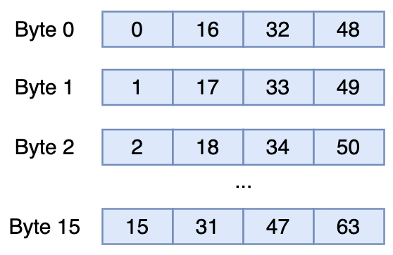
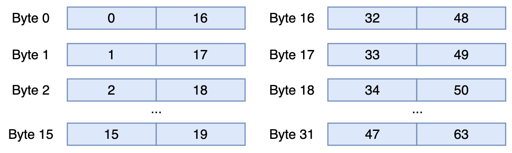
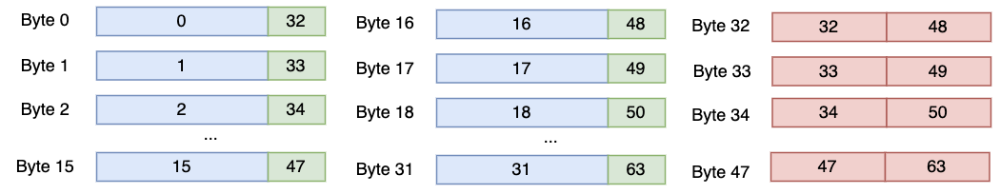

# Compact Storage of Codes

This section describes the compact storage of codes. RaBitQLib supports to quantize codes with different bit widths, i.e., 1, 2, 3, 4, 5, 6, 7 and 8. These bit widths except 8 are unaligned with byte alignment. Thus, we need to design a specialized compact storage format for the code vector for each bit width. We pad the dimensionality to a multiple of 64 for the ease of alignment. The implementation can be found in `rabitqlib/quantization/pack_excode.hpp`.

Example 
```cpp
#include <rabitqlib/quantization/pack_excode.hpp>
#include <stdint.h>
#include <random>

int main(){
    size_t dim = 768;
    size_t bits = 4;

    std::vector<uint8_t> code(dim);
    // Generate random 4-bit values (0-15) for each dimension
    for (size_t i = 0; i < dim; ++i) {
        code[i] = rand() % 16;  // 4-bit values range from 0 to 15
    }

    std::vector<uint8_t> compact_code(dim * bits / 8);

    rabitqlib::quant::rabitq_impl::ex_bits::packing_rabitqplus_code(
        code.data(), compact_code.data(), dim, bits
    );
}

```

The following shows the compact storage format for every 64 dimensions.


## 1-bit

The code sequentially stores the binary value for each of the 64 dimensions. 

## 2-bit

{ width=300px align=center }

The code is stored in a byte array of length 16. Each row in the figure represents a byte. The 0-th byte stores the 2-bit codes of the 0-th, 16-th, 32-th and 48-th dimensions. The 1-th byte stores the 2-bit codes of the 1-th, 17-th, 33-th and 49-th dimensions, so on and so forth. This storage allows efficient unpacking with SIMD, i.e., shifting and masking with `SSE`. 

## 3-bit = 2-bit + 1-bit

## 4-bit

{ width=600px align=center }


The code is stored in a byte array of length 32. The 0-th byte stores the 4-bit codes of the 0-th and 16-th dimensions. The 1-th byte stores the 4-bit codes of the 1-th and 17-th dimensions, so on and so forth. This storage allows efficient unpacking with SIMD, i.e., shifting and masking with `SSE`. 

## 5-bit = 4-bit + 1-bit

## 6-bit

{ width=900px align=center }

The code is stored in a byte array of length 48. 

- The first 16 bytes store the 6-bit codes of the 0-th to the 15-th dimensions and the upper 2-bit codes of the 32-th to 47-th dimensions.
- The second 16 bytes store the 6-bit codes of the 16-th to the 31-th dimensions and the upper 2-bit codes of the 48-th to 63-th dimensions.
- The third 16 bytes store the lower 4-bit codes of the 32-th to 47-th dimensions and the lower 4-bit codes of the 48-th to 63-th dimensions.

This storage allows efficient unpacking with SIMD, i.e., shifting and masking with `SSE`. 

## 7-bit = 6-bit + 1-bit

## 8-bit

The code of 8-bit is aligned with byte arrays and needs no specialized design.


